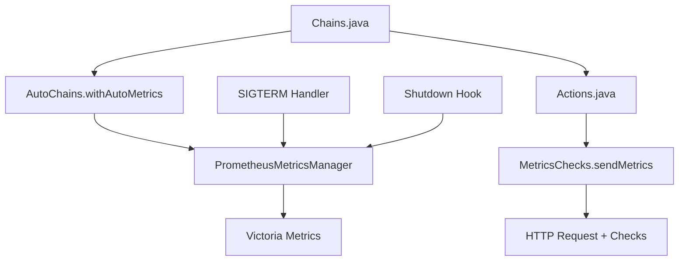

# Gatling Prometheus Metrics Plugin

[](https://github.com/Penelopa23/gatling-metrics-plugin)
[](https://gatling.io/)
[](https://www.scala-lang.org/)
[](LICENSE)

> **Профессиональный плагин для Gatling** с автоматическим сбором метрик и экспортом в Victoria Metrics/Prometheus. Поддерживает Kubernetes graceful shutdown.

## Быстрый старт

### 1. Подключение JAR
```bash
# Скачайте последнюю версию
wget https://github.com/Penelopa23/gatling-metrics-plugin/releases/latest/download/gatling-prometheus-plugin-fat.jar

# Добавьте в ваш проект Gatling
cp gatling-prometheus-plugin-fat.jar /path/to/your/gatling/project/lib/
```

### 2. Использование (3-слойная архитектура)

#### Слой 1: Chains (Высокоуровневый)
```java
// Chains.java - Оркестрация сценариев
public static ChainBuilder verifySignature(String signatureType) {
    return AutoChains.withAutoMetrics(
        feed(jsonFile(signatureType + ".json").circular())
        .exec(postVerifySignature(signatureType))  // ← Actions
        .exec(session -> {
            System.out.println("Response: " + session.getString("Response"));
            return session;
        }),
        "SVS-Signature-Verification",  // scenarioName для группировки
        "TC" + signatureType           // requestName для идентификации
    );
}
```

#### Слой 2: Actions (Средний)
```java
// Actions.java - Бизнес-логика HTTP запросов
public static HttpRequestActionBuilder postVerifySignature(String signatureType) {
    return MetricsChecks.sendMetrics(  // ← Автоматический сбор метрик
        http("TC" + signatureType)
            .post("/v1/svs-fk/signatures")
            .body(StringBody("${body.jsonStringify()}"))
            .check(status().is(200))
            .check(jsonPath("$..Result").exists())
    );
}
```

#### Слой 3: MetricsChecks (Низкоуровневый)
```scala
// MetricsChecks.scala - Сбор технических метрик
def sendMetrics(requestBuilder: HttpRequestActionBuilder): HttpRequestActionBuilder = {
  requestBuilder
    .check(responseTimeInMillis().saveAs("responseTime"))
    .check(bodyBytes().saveAs("responseSize"))
    .check(bodyString().saveAs("Response"))
    .check(status().saveAs("statusCode"))
}
```

### 3. Настройка Victoria Metrics (опционально)
```bash
export PENELOPA_REMOTE_WRITE_URL="http://victoria-metrics:8428/api/v1/import/prometheus"
export PENELOPA_PUSH_INTERVAL="5"  # интервал отправки в секундах
```

## Архитектура проекта

### Многоуровневая архитектура



### Принципы дизайна

| Слой | Ответственность | Компоненты |
|------|-----------------|------------|
| **Chains** | Оркестрация сценариев | `AutoChains.withAutoMetrics()` |
| **Actions** | Бизнес-логика HTTP | `MetricsChecks.sendMetrics()` |
| **MetricsChecks** | Технические метрики | HTTP checks, response data |
| **PrometheusMetricsManager** | Управление метриками | Сбор, агрегация, экспорт |

## Ключевые особенности

| Особенность | Описание | Преимущество |
|-------------|----------|--------------|
| **3-слойная архитектура** | Chains → Actions → MetricsChecks | Четкое разделение ответственности |
| **Автоматический сбор** | `MetricsChecks.sendMetrics()` автоматически добавляет checks | Никаких ручных вызовов |
| **Стандартные метрики** | Метрики в стандартном формате (`gatling_*`) | Совместимость с Prometheus |
| **Kubernetes ready** | SIGTERM handler для graceful shutdown | Надежная работа в K8s |
| **Thread-safe** | Безопасная работа в многопоточной среде | Стабильная работа |

## Использование

### Простое использование (Рекомендуется)

#### Автоматическое определение имен
```scala
import ru.x5.svs.gatling.prometheus.AutoChains
import io.gatling.javaapi.core.CoreDsl._
import io.gatling.javaapi.http.HttpDsl._

val scenario = scenario("My Test")
  .exec(
    AutoChains.withAutoMetrics(  // Без параметров - автоматическое определение
      http("API Request")
        .get("/api/endpoint")
        .check(status().is(200))
    )
  )
```

#### С указанием имен для точной группировки
```scala
val scenario = scenario("SVS Load Test")
  .exec(
    AutoChains.withAutoMetrics(
      http("API Request")
        .get("/api/endpoint")
        .check(status().is(200)),
      "SVS-Signature-Verification",  // scenarioName для группировки
      "GetUsers"                    // requestName для идентификации
    )
  )
```

### Продвинутое использование (3-слойная архитектура)

#### Слой 1: Chains - Оркестрация
```java
// Chains.java
public class Chains {
    public static ChainBuilder verifySignature(String signatureType) {
        return AutoChains.withAutoMetrics(
            feed(jsonFile(signatureType + ".json").circular())
            .exec(postVerifySignature(signatureType))
            .exec(session -> {
                // Дополнительная обработка
                System.out.println("Response: " + session.getString("Response"));
                return session;
            }),
            "SVS-Signature-Verification",  // scenarioName
            "TC" + signatureType           // requestName
        );
    }
}
```

#### Слой 2: Actions - Бизнес-логика
```java
// Actions.java
public class Actions {
    public static HttpRequestActionBuilder postVerifySignature(String signatureType) {
        return MetricsChecks.sendMetrics(  // Автоматический сбор метрик
            http("TC" + signatureType)
                .post("/v1/svs-fk/signatures")
                .body(StringBody("${body.jsonStringify()}"))
                .check(status().is(200))
                .check(jsonPath("$..Result").exists())
        );
    }
}
```

#### Слой 3: MetricsChecks - Технические метрики
```scala
// MetricsChecks.scala
object MetricsChecks {
  def sendMetrics(requestBuilder: HttpRequestActionBuilder): HttpRequestActionBuilder = {
    requestBuilder
      .check(responseTimeInMillis().saveAs("responseTime"))
      .check(bodyBytes().saveAs("responseSize"))
      .check(bodyString().saveAs("Response"))
      .check(status().saveAs("statusCode"))
  }
}
```

### Сравнение подходов

| Подход | Код | Преимущества | Недостатки |
|--------|-----|--------------|------------|
| **Автоматический** | `AutoChains.withAutoMetrics(chain)` | Простота, меньше кода | Менее точные имена метрик |
| **С параметрами** | `AutoChains.withAutoMetrics(chain, scenario, request)` | Точные имена, лучшая группировка | Больше кода |
| **3-слойная** | Chains → Actions → MetricsChecks | Полный контроль, масштабируемость | Сложнее для простых случаев |

## Экспортируемые метрики

### HTTP метрики
```promql
# Количество HTTP запросов
gatling_http_reqs_total{testid="test-123", name="TC01_CAdES_BES_ATTACHED", status="OK"}

# Неудачные запросы  
gatling_http_req_failed{testid="test-123", name="TC01_CAdES_BES_ATTACHED", status="KO"}

# Время ответа (среднее)
gatling_http_req_duration{testid="test-123", name="TC01_CAdES_BES_ATTACHED", status="OK"}
```

### Виртуальные пользователи
```promql
# Текущее количество VU
gatling_vus{testid="test-123", pod="runner-abc"}

# Пиковое количество VU
gatling_vus_peak{testid="test-123", pod="runner-abc"}
```

### Системные метрики
```promql
# Использование памяти
gatling_memory_heap_inuse_bytes{testid="test-123"}

# GC статистика
gatling_gc_count{testid="test-123"}
```

## Конфигурация

### Переменные окружения

| Переменная | Описание | По умолчанию |
|------------|----------|--------------|
| `PENELOPA_REMOTE_WRITE_URL` | URL Victoria Metrics | `http://localhost:8428/api/v1/import/prometheus` |
| `PENELOPA_PUSH_INTERVAL` | Интервал отправки (сек) | `5` |
| `PENELOPA_TEST_ID` | ID теста | `auto-generated` |
| `PENELOPA_POD` | Имя пода | `auto-detected` |

### Системные свойства
```bash
-Dpenelopa.remote.write.url=http://victoria:8428/api/v1/import/prometheus
-Dpenelopa.push.interval=10
-Dpenelopa.test.id=my-test-123
-Dpenelopa.pod=runner-abc
```

## Использование в Grafana

### Основные запросы

```promql
# HTTP запросы в секунду
sum(rate(gatling_http_reqs_total{testid=~"$testid"}[$__interval]))

# Процент ошибок
sum(rate(gatling_http_req_failed{testid=~"$testid"}[$__interval])) / 
sum(rate(gatling_http_reqs_total{testid=~"$testid"}[$__interval])) * 100

# Среднее время ответа
avg(gatling_http_req_duration{testid=~"$testid"})

# Текущие VU
sum(gatling_vus{testid=~"$testid"})

# Использование памяти
sum(gatling_memory_heap_inuse_bytes{testid=~"$testid"}) / 1024 / 1024
```

### Дашборды
- **HTTP метрики** - запросы, ошибки, время ответа
- **VU метрики** - текущие и пиковые пользователи  
- **Системные метрики** - память, GC, CPU

## Правильное использование в Simulation

### Обязательный after{} блок
Для гарантированной отправки финальных метрик используйте `after{}` блок в Simulation:

```scala
class MySimulation extends Simulation {
  // Создаем writer
  val writer = new PrometheusRemoteWriter(
    victoriaMetricsUrl = "http://victoria-metrics:8428/api/v1/import/prometheus",
    testId = "my-test-123",
    pod = "runner-abc"
  )

  before {
    println("[before] Starting metrics writer")
    writer.start()  // Запускаем периодическую отправку
  }

  // Ваши сценарии...
  val scn = scenario("MyScenario")
    .exec(AutoChains.withAutoMetrics(
      http("MyRequest").get("/api/test"),
      "MyScenario",
      "MyRequest"
    ))

  setUp(scn.inject(rampUsers(10).during(30.seconds)))

  after {
    println("[after] Final flush - guaranteed execution")
    writer.stop()  // Блокирующий flush с таймаутами
  }

  // Fallback для экстренных случаев
  sys.addShutdownHook {
    println("[hook] Emergency flush (fallback)")
    writer.stop()
  }
}
```

### Ключевые особенности:
- **`after{}`** - гарантированно выполняется при нормальном окончании
- **`writer.stop()`** - блокирующий flush с таймаутами и gzip
- **`sys.addShutdownHook`** - fallback для экстренных случаев
- **Идемпотентность** - повторные вызовы `stop()` безопасны

## Kubernetes интеграция

### Graceful shutdown
Плагин автоматически обрабатывает `SIGTERM` сигналы в Kubernetes:

```yaml
apiVersion: batch/v1
kind: Job
metadata:
  name: gatling-test
spec:
  template:
    spec:
      containers:
      - name: gatling
        image: gatling:latest
        env:
        - name: PENELOPA_REMOTE_WRITE_URL
          value: "http://victoria-metrics:8428/api/v1/import/prometheus"
        # Graceful shutdown настроен автоматически
```

### Логирование
```bash
# Включите детальное логирование
kubectl logs -f job/gatling-test | grep "METRIC\|ERROR\|SUCCESS"
```

## Разработка

### Сборка
```bash
# Клонируйте репозиторий
git clone https://github.com/Penelopa23/gatling-metrics-plugin.git
cd gatling-metrics-plugin

# Соберите плагин
sbt compile assembly

# JAR будет в target/scala-2.13/gatling-prometheus-plugin-fat.jar
```

### Тестирование
```bash
# Запустите тесты
sbt test

# Создайте тестовый JAR
sbt "set version := \"1.3.8\"" assembly
```

### Структура проекта
```
src/main/scala/ru/x5/svs/gatling/prometheus/
├── AutoChains.scala              # Основной API (Chains слой)
├── PrometheusMetricsManager.scala # Управление метриками  
├── PrometheusRemoteWriter.scala   # Отправка метрик
├── MetricsQueue.scala             # Очередь метрик
├── MetricsChecks.scala             # Сбор HTTP метрик (Actions слой)
├── ConfigurationLoader.scala     # Конфигурация
└── HttpMetricsCollector.scala    # Сбор HTTP метрик
```

## Интеграция с существующими системами

### Совместимость с Prometheus
Плагин генерирует стандартные метрики в формате Prometheus:

| Метрика | Описание | Тип |
|---------|----------|-----|
| `gatling_http_reqs_total` | HTTP запросы | Counter |
| `gatling_http_req_failed` | Неудачные запросы | Counter |
| `gatling_http_req_duration` | Время ответа | Gauge |
| `gatling_vus` | Виртуальные пользователи | Gauge |

### Примеры запросов
```promql
# HTTP запросы в секунду
sum(rate(gatling_http_reqs_total{testid=~"$testid"}[$__interval]))

# Процент ошибок
sum(rate(gatling_http_req_failed{testid=~"$testid"}[$__interval])) / 
sum(rate(gatling_http_reqs_total{testid=~"$testid"}[$__interval])) * 100
```

## Совместимость

| Компонент | Версия | Примечание |
|-----------|--------|------------|
| **Gatling** | 3.10+ | Основной фреймворк |
| **Scala** | 2.13 | Язык программирования |
| **Java** | 11+ | Runtime |
| **Victoria Metrics** | 1.0+ | База метрик |
| **Prometheus** | 2.0+ | Формат метрик |
| **Kubernetes** | 1.20+ | Оркестрация |

## Дополнительные ресурсы

- **[Документация Gatling](https://gatling.io/docs/)** - Официальная документация
- **[Victoria Metrics](https://docs.victoriametrics.com/)** - Документация по VM
- **[Prometheus](https://prometheus.io/docs/)** - Документация по Prometheus
- **[Grafana](https://grafana.com/docs/)** - Визуализация метрик

## Вклад в проект

1. **Fork** репозитория
2. **Создайте** feature branch (`git checkout -b feature/amazing-feature`)
3. **Commit** изменения (`git commit -m 'Add amazing feature'`)
4. **Push** в branch (`git push origin feature/amazing-feature`)
5. **Откройте** Pull Request

### Принципы разработки
- Следуйте **3-слойной архитектуре** (Chains → Actions → MetricsChecks)
- Покрывайте код **тестами**
- Документируйте **изменения**
- Используйте **адаптеры** для совместимости

## Лицензия

Этот проект лицензирован под MIT License - см. файл [LICENSE](LICENSE) для деталей.

## Поддержка

- **Issues**: [GitHub Issues](https://github.com/Penelopa23/gatling-metrics-plugin/issues)
- **Discussions**: [GitHub Discussions](https://github.com/Penelopa23/gatling-metrics-plugin/discussions)
- **Email**: support@penelopa.dev

---

**Сделано для сообщества Gatling**