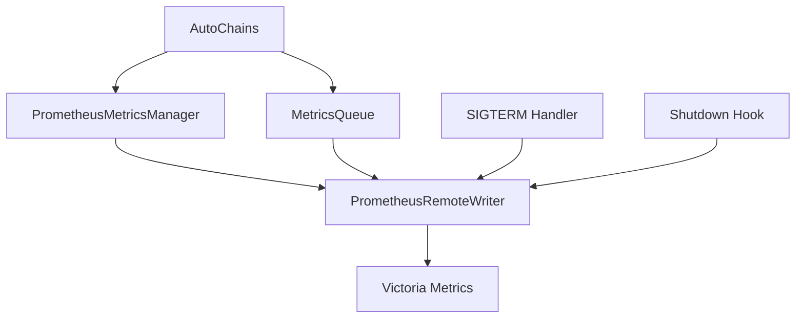

# Gatling Prometheus Metrics Plugin

[](https://github.com/Penelopa23/gatling-metrics-plugin)
[](https://gatling.io/)
[](https://www.scala-lang.org/)
[](LICENSE)

> **Профессиональный плагин для Gatling** с автоматическим сбором метрик и экспортом в Victoria Metrics/Prometheus. Совместим с k6 метриками и поддерживает Kubernetes graceful shutdown.

## 🚀 Быстрый старт

### 1. Подключение JAR
```bash
# Скачайте последнюю версию
wget https://github.com/Penelopa23/gatling-metrics-plugin/releases/latest/download/gatling-prometheus-plugin-fat.jar

# Добавьте в ваш проект Gatling
cp gatling-prometheus-plugin-fat.jar /path/to/your/gatling/project/lib/
```

### 2. Использование (2 строки кода!)
```scala
import ru.x5.svs.gatling.prometheus.AutoChains
import io.gatling.javaapi.core.CoreDsl._
import io.gatling.javaapi.http.HttpDsl._

val scenario = scenario("My Test")
  .exec(
    AutoChains.withAutoMetrics(  // ← Просто оберните вашу цепочку!
      http("API Request")
        .get("/api/endpoint")
        .check(status().is(200))
    )
  )

// Метрики автоматически отправляются в Victoria Metrics! 🎯
```

### 3. Настройка Victoria Metrics (опционально)
```bash
export PENELOPA_REMOTE_WRITE_URL="http://victoria-metrics:8428/api/v1/import/prometheus"
export PENELOPA_PUSH_INTERVAL="5"  # интервал отправки в секундах
```

## ✨ Ключевые особенности

| Особенность | Описание | Преимущество |
|-------------|----------|--------------|
| **🎯 Автоматический сбор** | Просто оберните цепочку в `AutoChains.withAutoMetrics()` | Никаких ручных вызовов |
| **📊 k6 совместимость** | Метрики называются как в k6 (`gatling_*`) | Легкая миграция с k6 |
| **☸️ Kubernetes ready** | SIGTERM handler для graceful shutdown | Надежная работа в K8s |
| **🔧 Простая интеграция** | Один JAR файл, никаких зависимостей | Быстрое внедрение |
| **📈 Детальные метрики** | HTTP, VU, системные метрики | Полная картина производительности |
| **🛡️ Thread-safe** | Безопасная работа в многопоточной среде | Стабильная работа |

## 📊 Экспортируемые метрики

### HTTP метрики
```promql
# Количество HTTP запросов
gatling_http_reqs_total{testid="test-123", name="API_Call", status="OK"}

# Неудачные запросы  
gatling_http_req_failed{testid="test-123", name="API_Call", status="KO"}

# Время ответа (среднее)
gatling_http_req_duration{testid="test-123", name="API_Call", status="OK"}
```

### Виртуальные пользователи
```promql
# Текущее количество VU
gatling_vus{testid="test-123", pod="runner-abc"}

# Пиковое количество VU
gatling_vus_peak{testid="test-123", pod="runner-abc"}
```

### Системные метрики
```promql
# Использование памяти
gatling_memory_heap_inuse_bytes{testid="test-123"}

# GC статистика
gatling_gc_count{testid="test-123"}
```

## 🏗️ Архитектура

### Принципы дизайна
- **SOLID принципы** - легко тестируемый и расширяемый код
- **Thread-safe** - безопасная работа в многопоточной среде  
- **Graceful shutdown** - корректное завершение в Kubernetes
- **Минимальные зависимости** - только необходимые библиотеки

### Основные компоненты



## 💻 Использование

### Простое использование (Рекомендуется)
```scala
import ru.x5.svs.gatling.prometheus.AutoChains
import io.gatling.javaapi.core.CoreDsl._
import io.gatling.javaapi.http.HttpDsl._

val scenario = scenario("Load Test")
  .exec(
    AutoChains.withAutoMetrics(
      http("Get Users")
        .get("/api/users")
        .check(status().is(200))
        .check(jsonPath("$.users").exists())
    )
  )
  .exec(
    AutoChains.withAutoMetrics(
      http("Create User") 
        .post("/api/users")
        .body(StringBody("""{"name": "John"}"""))
        .check(status().is(201))
    )
  )

setUp(scenario.injectOpen(rampUsers(100).during(60)))
  .protocols(http.baseUrl("http://localhost:8080"))
```

### Автоматическое определение имен
```scala
// Плагин автоматически определит имена из контекста
val scenario = scenario("Auto Test")
  .exec(
    AutoChains.withAutoMetrics(  // Без параметров - автоматическое определение
      http("Auto Request")
        .get("/api/auto")
        .check(status().is(200))
    )
  )
```

### Продвинутое использование
```scala
import ru.x5.svs.gatling.prometheus.{PrometheusMetricsManager, MetricsQueue}

// Ручное управление метриками
val manager = PrometheusMetricsManager.getInstance()

// Запись кастомных метрик
manager.recordHttpRequest(
  scenario = "CustomTest",
  requestName = "CustomAPI", 
  method = "POST",
  status = "OK",
  responseTime = 150L
)

// Отслеживание VU
MetricsQueue.updateVirtualUsersCount(10)
```

## 🔧 Конфигурация

### Переменные окружения

| Переменная | Описание | По умолчанию |
|------------|----------|--------------|
| `PENELOPA_REMOTE_WRITE_URL` | URL Victoria Metrics | `http://localhost:8428/api/v1/import/prometheus` |
| `PENELOPA_PUSH_INTERVAL` | Интервал отправки (сек) | `5` |
| `PENELOPA_TEST_ID` | ID теста | `auto-generated` |
| `PENELOPA_POD` | Имя пода | `auto-detected` |

### Системные свойства
```bash
-Dpenelopa.remote.write.url=http://victoria:8428/api/v1/import/prometheus
-Dpenelopa.push.interval=10
-Dpenelopa.test.id=my-test-123
-Dpenelopa.pod=runner-abc
```

## 📈 Использование в Grafana

### Основные запросы

```promql
# HTTP запросы в секунду
sum(rate(gatling_http_reqs_total{testid=~"$testid"}[$__interval]))

# Процент ошибок
sum(rate(gatling_http_req_failed{testid=~"$testid"}[$__interval])) / 
sum(rate(gatling_http_reqs_total{testid=~"$testid"}[$__interval])) * 100

# Среднее время ответа
avg(gatling_http_req_duration{testid=~"$testid"})

# Текущие VU
sum(gatling_vus{testid=~"$testid"})

# Использование памяти
sum(gatling_memory_heap_inuse_bytes{testid=~"$testid"}) / 1024 / 1024
```

### Дашборды
- **HTTP метрики** - запросы, ошибки, время ответа
- **VU метрики** - текущие и пиковые пользователи  
- **Системные метрики** - память, GC, CPU
- **Сравнение с k6** - side-by-side метрики

## 🐳 Kubernetes интеграция

### Graceful shutdown
Плагин автоматически обрабатывает `SIGTERM` сигналы в Kubernetes:

```yaml
apiVersion: batch/v1
kind: Job
metadata:
  name: gatling-test
spec:
  template:
    spec:
      containers:
      - name: gatling
        image: gatling:latest
        env:
        - name: PENELOPA_REMOTE_WRITE_URL
          value: "http://victoria-metrics:8428/api/v1/import/prometheus"
        # Graceful shutdown настроен автоматически
```

### Логирование
```bash
# Включите детальное логирование
kubectl logs -f job/gatling-test | grep "📊\|🔥\|✅"
```

## 🧪 Разработка

### Сборка
```bash
# Клонируйте репозиторий
git clone https://github.com/Penelopa23/gatling-metrics-plugin.git
cd gatling-metrics-plugin

# Соберите плагин
sbt compile assembly

# JAR будет в target/scala-2.13/gatling-prometheus-plugin-fat.jar
```

### Тестирование
```bash
# Запустите тесты
sbt test

# Создайте тестовый JAR
sbt "set version := \"1.3.8\"" assembly
```

### Структура проекта
```
src/main/scala/ru/x5/svs/gatling/prometheus/
├── AutoChains.scala              # 🚀 Основной API
├── PrometheusMetricsManager.scala # 📊 Управление метриками  
├── PrometheusRemoteWriter.scala   # 📤 Отправка метрик
├── MetricsQueue.scala             # 📋 Очередь метрик
├── ConfigurationLoader.scala     # ⚙️ Конфигурация
└── HttpMetricsCollector.scala    # 🔍 Сбор HTTP метрик
```

## 🔄 Миграция с k6

### Сравнение метрик

| k6 метрика | Gatling метрика | Описание |
|------------|-----------------|----------|
| `k6_http_reqs` | `gatling_http_reqs_total` | HTTP запросы |
| `k6_http_req_failed` | `gatling_http_req_failed` | Неудачные запросы |
| `k6_http_req_duration` | `gatling_http_req_duration` | Время ответа |
| `k6_vus` | `gatling_vus` | Виртуальные пользователи |

### Миграция дашбордов
```promql
# Было (k6)
sum(rate(k6_http_reqs{testid=~"$testid"}[$__interval]))

# Стало (Gatling)  
sum(rate(gatling_http_reqs_total{testid=~"$testid"}[$__interval]))
```

## 🏷️ Совместимость

| Компонент | Версия | Примечание |
|-----------|--------|------------|
| **Gatling** | 3.10+ | Основной фреймворк |
| **Scala** | 2.13 | Язык программирования |
| **Java** | 11+ | Runtime |
| **Victoria Metrics** | 1.0+ | База метрик |
| **Prometheus** | 2.0+ | Формат метрик |
| **Kubernetes** | 1.20+ | Оркестрация |

## 📚 Дополнительные ресурсы

- **[Документация Gatling](https://gatling.io/docs/)** - Официальная документация
- **[Victoria Metrics](https://docs.victoriametrics.com/)** - Документация по VM
- **[Prometheus](https://prometheus.io/docs/)** - Документация по Prometheus
- **[Grafana](https://grafana.com/docs/)** - Визуализация метрик

## 🤝 Вклад в проект

1. **Fork** репозитория
2. **Создайте** feature branch (`git checkout -b feature/amazing-feature`)
3. **Commit** изменения (`git commit -m 'Add amazing feature'`)
4. **Push** в branch (`git push origin feature/amazing-feature`)
5. **Откройте** Pull Request

### Принципы разработки
- Следуйте **SOLID** принципам
- Покрывайте код **тестами**
- Документируйте **изменения**
- Используйте **адаптеры** для совместимости

## 📄 Лицензия

Этот проект лицензирован под MIT License - см. файл [LICENSE](LICENSE) для деталей.

## 🆘 Поддержка

- **Issues**: [GitHub Issues](https://github.com/Penelopa23/gatling-metrics-plugin/issues)
- **Discussions**: [GitHub Discussions](https://github.com/Penelopa23/gatling-metrics-plugin/discussions)
- **Email**: support@penelopa.dev

---

**Сделано с ❤️ для сообщества Gatling**